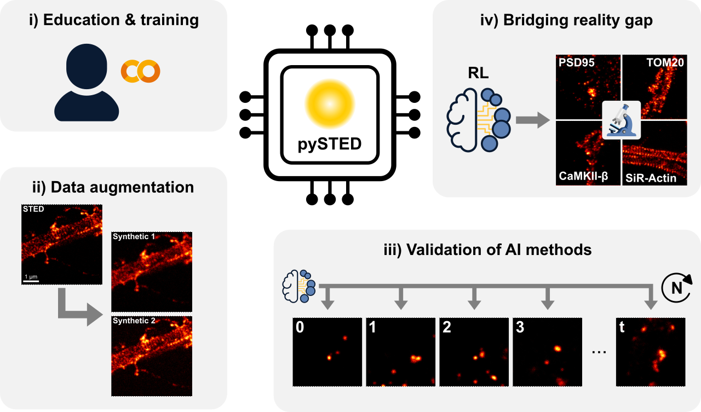

# pySTED

<a target="_blank" href="https://colab.research.google.com/drive/128pOe4KwnZ7MH6HFcd-mG1HjwDWvohnq?usp=sharing">
  
</a>

We have built a realistic STED simulation platform within the Python environment, namely pysted. pysted breaks down a STED acquisition into its main constituents: wavelength dependent focusing properties of the objective lens, fluorophore excitation and depletion, and fluorescence detection. Each step of the acquisition process corresponds to an independent component of the pipeline and is created with its own parameters that users can modify according to their experimental requirements. Generating a synthetic image with the pysted simulator requires the user to specify the positions of the emitters in the field of view (referred to as datamap) and to provide the characteristics of the fluorophore). The emission and photobleaching properties of the fluorophores that are implemented in pysted and inspired from previous theoretical and experimental models. As in a real experiment, the datamap is continuously being updated during the simulation process to realistically simulate point-scanning acquisition schemes.

In this repository, we provide a few datamaps that can be loaded using the provided tools. However, if the user wants to create their own datamaps, we also provide the code to generate their datamaps at this [repository](https://github.com/FLClab/unet_dmap_gen).

## Installation

We recommend using a virtual environment in which to install pySTED. [Anaconda](https://docs.anaconda.com/anaconda/install/index.html) facilitates the creation of a virtual environment on most operating system. For exemple, a virtual environment can be created using
```bash
conda create --name pysted python=3.10
conda activate pysted
```

### Using pip

We do not provide a pypi installation package (yet). The user can however install pySTED using the url of the current repository
```bash
pip install pysted
```

### From source 

Clone the repository on your computer 
```bash
git clone https://github.com/FLClab/pySTED.git
```

To install the necessary public libraries, run
```bash
python -m pip install -r pySTED/requirements.txt
python -m pip install -e pySTED
```

*Note.* Using the local install will require to compile the cython code that are required in pySTED.

## Usage

We highly recommend to run the provided notebook to get some insight about how to use pySTED. 

### Notebook

A [Google Colab](https://colab.research.google.com/drive/128pOe4KwnZ7MH6HFcd-mG1HjwDWvohnq?usp=sharing) jupyter notebook is provided to learn the basics of `pysted`.

### Local
  
Once `pysted` is installed, running the example script should be possible.
```bash 
python pySTED_tutorial.py
```

## Citation

If you use any material from this repository please cite the following
```bibtex
@article{bilodeau2024development,
  title={Development of AI-assisted microscopy frameworks through realistic simulation in pySTED},
  author={Bilodeau, Anthony and Michaud-Gagnon, Albert and Chabbert, Julia and Turcotte, Benoit and Heine, J{\"o}rn and Durand, Audrey and Lavoie-Cardinal, Flavie},
  journal={bioRxiv},
  pages={2024--03},
  year={2024},
  publisher={Cold Spring Harbor Laboratory}
}
```
